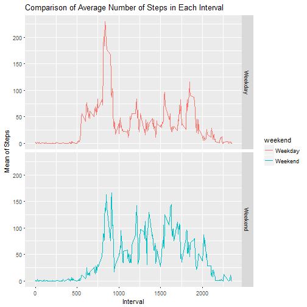

## Overview
This assignment makes use of data from a personal activity monitoring device.
This device collects data at 5 minute intervals throughout the day. The data 
consists of two months of data from an anonymous individual collected during 
the months of October and November, 2012 and include the number of steps taken 
in 5 minute intervals each day.


```r
library(dplyr)
library(ggplot2)
```
## Loading and preprocessing the data

```r
actData <- read.csv("activity.csv", header = TRUE)
head(actData)
```

```
##   steps       date interval
## 1    NA 2012-10-01        0
## 2    NA 2012-10-01        5
## 3    NA 2012-10-01       10
## 4    NA 2012-10-01       15
## 5    NA 2012-10-01       20
## 6    NA 2012-10-01       25
```

## What is mean total number of steps taken per day?

```r
steps <- aggregate(actData$steps, by = list(Date = actData$date), FUN = sum)
names(steps)[names(steps) == "x"] <- "Total"
temp <- as.Date(steps$Date, "%Y-%m-%d")
steps$Date <- format(temp, format = "%m-%d")
head(steps)
```

```
##    Date Total
## 1 10-01    NA
## 2 10-02   126
## 3 10-03 11352
## 4 10-04 12116
## 5 10-05 13294
## 6 10-06 15420
```

```r
ggplot(data = na.omit(steps), aes(Total)) + geom_histogram(binwidth = 1500, colour = "white") +
    xlab("Total Number of Steps Taken Each Day") + ylab("Count") +
    ggtitle("Histogram of the Total Number of Steps Taken Each Day")
```


```r
mean(na.omit(steps$Total))
```

```
## [1] 10766.19
```

```r
median(na.omit(steps$Total))
```

```
## [1] 10765
```

## What is the average daily activity pattern?

```r
pattern <- aggregate(steps ~ interval, data = actData, FUN =mean)
ggplot(data = pattern, aes(x = interval, y = steps)) + geom_line() +
    xlab("Time Intervals (5 Minutes interval)") + ylab("Total Number of Steps") +
    ggtitle("Average Number of Steps Taken in 5-Minute Interval")
```


```r
head(pattern)
```

```
##   interval     steps
## 1        0 1.7169811
## 2        5 0.3396226
## 3       10 0.1320755
## 4       15 0.1509434
## 5       20 0.0754717
## 6       25 2.0943396
```

```r
pattern[which(pattern$steps == max(pattern$steps)),]
```

```
##     interval    steps
## 104      835 206.1698
```

## Imputing missing values

```r
sapply(X = actData, FUN = function(x) sum(is.na(x)))
```

```
##    steps     date interval 
##     2304        0        0
```
## Replace with Mean

```r
replacewithmean <- function(x) replace(x, is.na(x), mean(x, na.rm = TRUE))
meandata <- actData%>% group_by(interval) %>% mutate(steps= replacewithmean(steps))
head(meandata)
```

```
## # A tibble: 6 x 3
## # Groups:   interval [6]
##    steps date       interval
##    <dbl> <fct>         <int>
## 1 1.72   2012-10-01        0
## 2 0.340  2012-10-01        5
## 3 0.132  2012-10-01       10
## 4 0.151  2012-10-01       15
## 5 0.0755 2012-10-01       20
## 6 2.09   2012-10-01       25
```

```r
newdata <- as.data.frame(meandata)
```

```r
head(newdata)
```

```
##       steps       date interval
## 1 1.7169811 2012-10-01        0
## 2 0.3396226 2012-10-01        5
## 3 0.1320755 2012-10-01       10
## 4 0.1509434 2012-10-01       15
## 5 0.0754717 2012-10-01       20
## 6 2.0943396 2012-10-01       25
```

```r
summary(newdata)
```

```
##      steps                date          interval     
##  Min.   :  0.00   2012-10-01:  288   Min.   :   0.0  
##  1st Qu.:  0.00   2012-10-02:  288   1st Qu.: 588.8  
##  Median :  0.00   2012-10-03:  288   Median :1177.5  
##  Mean   : 37.38   2012-10-04:  288   Mean   :1177.5  
##  3rd Qu.: 27.00   2012-10-05:  288   3rd Qu.:1766.2  
##  Max.   :806.00   2012-10-06:  288   Max.   :2355.0  
##                   (Other)   :15840
```

```r
stepsByDay <- tapply(meandata$steps, meandata$date, sum)
qplot(stepsByDay, xlab='Total steps per day', ylab='Frequency', binwidth=500)
```


## Compare Mean and Median 

```r
mean(na.omit(steps$Total))
```

```
## [1] 10766.19
```

```r
mean(na.omit(steps$Total))
```

```
## [1] 10766.19
```

```r
median(na.omit(steps$Total))
```

```
## [1] 10765
```

```r
median(na.omit(steps$Total))
```

```
## [1] 10765
```

## Are there differences in activity patterns between weekdays and weekends?


```r
meandata$date <- as.Date(meandata$date)
meandata$weekday <- weekdays(meandata$date)
meandata$weekend <- ifelse(meandata$weekday=="Saturday" | meandata$weekday=="Sunday", "Weekend", "Weekday" )
meandataweekendweekday <- aggregate(meandata$steps , by= list(meandata$weekend, meandata$interval), na.omit(mean))
names(meandataweekendweekday) <- c("weekend", "interval", "steps")
ggplot(meandataweekendweekday, aes(x=interval, y=steps, color=weekend)) + geom_line()+
facet_grid(weekend ~.) + xlab("Interval") + ylab("Mean of Steps") +
    ggtitle("Comparison of Average Number of Steps in Each Interval")
```



## Conclusion:
 From the two plots it seems that the test object is more active earlier in the day
 during weekdays compared to weekends, but more active throughout the weekends compared
 with weekdays.
